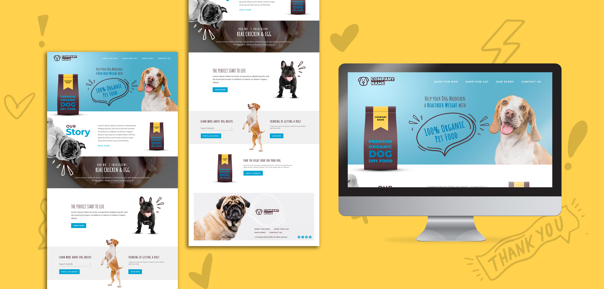

# MINI-PROJECT: PET FOOD SHOP LANDING PAGE

**This is a project that I practice my front-end skills.**

- Practice new skills:
>* Convert psd to a react app
>* BEM
>* Sass

- Improve old skills:
>* HTML5
>* CSS3
>* ES6
>* Reactjs

## Template

PSD taken from: [https://www.freepik.com/free-psd/organic-dog-food-landing-page_7041910.htm](https://www.freepik.com/free-psd/organic-dog-food-landing-page_7041910.htm)

## No responsive yet

I tried to convert the psd file to a react app with perfect pixel accuracy. So, it's not good for responsive.

## Live website

[https://deehuynh.github.io/pet-food-01/](https://deehuynh.github.io/pet-food-01/)